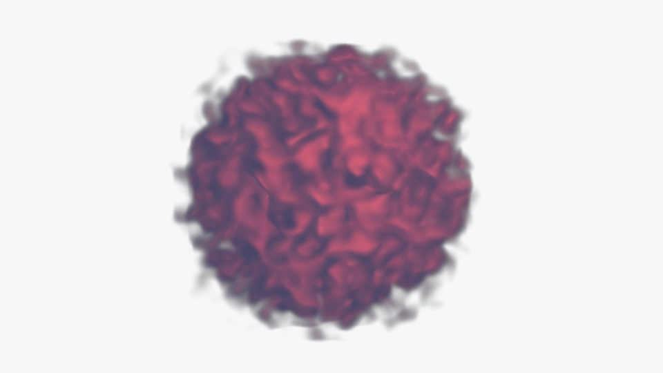
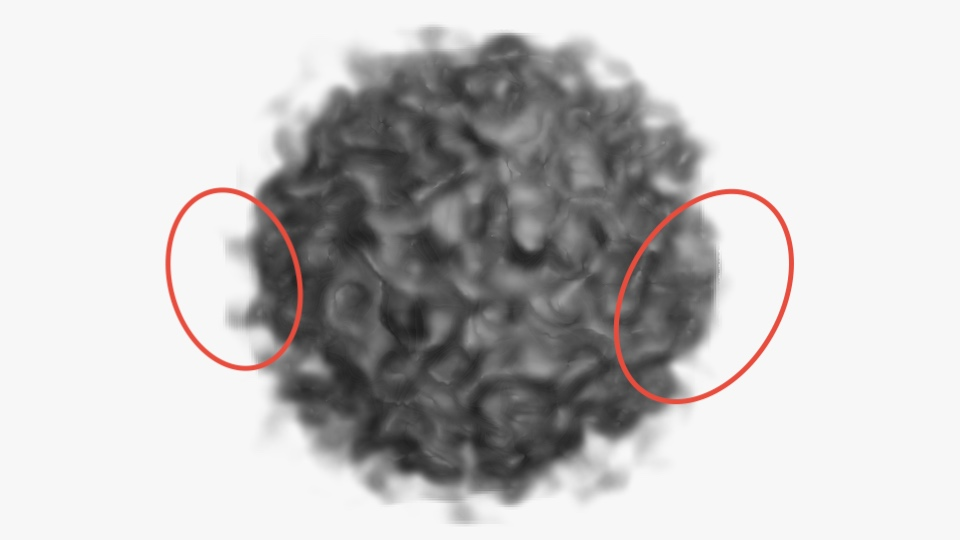
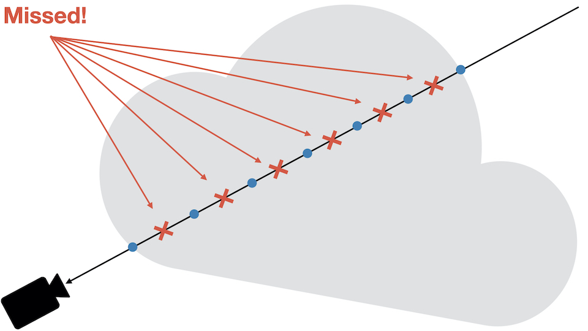

Second part of [Behind The Scene: Cloud Raymarching Demo](),
in which we will go through how to improve the lighting and how to create the burning effect.

<!--more-->


This blog post will be a lot less driven by theory, and a lot more by
experimentation, tweaking, trial & error :)

In this post, we will have a look at:
* How to sample lights in the shader;
* How to add some eye candy (light color, absorption, etc...);
* how to improve performance;
* As well as how to reduce visual artefacts.

## Light Support

Right now, light contribution is hardcoded in the shader. It's not user
friendly and our shader doesn't interact with the scene lights.

Using a `ShaderMaterial`, it's possible to directly re-use the lights added
in the scene. For simplicity, we are only going to focus on the [PointLight](https://threejs.org/docs/#api/en/lights/PointLight) type.

Let's modify our material and our shader to receive the lights information
from the scene:

_material.js_

```js
import { ..., UniformsLib, UniformsUtils, ...} from 'three';

export class CloudMaterial extends ShaderMaterial {

  constructor() {
    super({
      vertexShader: cloudVertexShader,
      fragmentShader: cloudFragmentShader,
      uniforms: UniformsUtils.merge([
        UniformsLib.lights,
        {
          ...
        }
      ])
    });

    ...

    // This is where the magic happens. `true` makes the
    // lights uniforms available to the shader.
    this.lights = true;
  }
```

Three.js is now aware we want our shader to be supplied with light data. We can
modify the shader as well:

_cloud.frag.glsl_

```glsl
...
precision highp float;
precision highp sampler3D;

...

#if ( NUM_POINT_LIGHTS > 0 )
uniform PointLight pointLights[ NUM_POINT_LIGHTS ];
#endif // NUM_POINT_LIGHTS > 0
```

This code will compile the `uniform` line only if point lights are available
in the scene. Three.js`THREE.WebGLRenderer` replaces the `NUM_POINT_LIGHTS` string
by the number of lights visible. This is done in the method [replaceLightNums()](https://github.com/mrdoob/three.js/blob/dev/src/renderers/webgl/WebGLProgram.js).

With the lights available in the shader, we can compute the lighting contribution
at each sample position. Let's create a new function in charge of computing the
irradiance coming from a given point:

_cloud.frag.glsl_

```glsl
/**
 * Computes the diffuse lighting at the point `originViewSpace`
 * with normal `normalViewSpace`.
 *
 * **NOTE**: For now, the lighting is done in **view** space.
 * Be careful not to give model space / world space parameters.
 */
vec3
computeIrradiance(vec3 originViewSpace, vec3 gradient)
{
  // Accumulated light contribution of all point lights.
  vec3 acc = vec3(0.0);

  #if ( NUM_POINT_LIGHTS > 0 )

  for (int i = 0; i < NUM_POINT_LIGHTS; ++i) {
    PointLight p = pointLights[ i ];
    vec3 posToLight = p.position - originViewSpace;
    float len = length(posToLight);

    // The dot product tells us how colinear the light
    // direction is to our normal.
    // The more aligned, the more energy we want to reflect back.
    float NdotL = dot(normalViewSpace, normalize(posToLight));
    NdotL = max(0.1, NdotL);

    // Non-linear light dimming with distance.
    float dimming = pow(
      saturate(-len / p.distance + 1.0), p.decay
    );
    acc += p.color * dimming * NdotL;
  }

  #endif

  return acc;
}
```

The loop goes through the list of lights, and computes the irradiance at the sample
position. Let's decompose this function together to understand it bit by bit.

_cloud.frag.glsl_

```glsl
for (int i = 0; i < NUM_POINT_LIGHTS; ++i) {
  PointLight p = pointLights[ i ];
  vec3 posToLight = p.position - originViewSpace;
  float len = length(posToLight);

  // The dot product tells us how colinear the light direction
  // is to our normal. The more aligned, the more energy
  // we want to reflect back.
  float NdotL = dot(normalViewSpace, normalize(posToLight));
  NdotL = max(0.1, NdotL);

  ...
}
```

We first retrieve the light data, and we compute the classic [Lambert's Cosine Law](https://en.wikipedia.org/wiki/Lambert%27s_cosine_law#:~:text=In%20optics%2C%20Lambert's%20cosine%20law,light%20and%20the%20surface%20normal.). When the normal is parallel to the
direction from the sample to the light, the diffusion is **maximized**.
At the opposite, when both are perpendicular and/or opposed, the light diffusion
is closer to **zero**.

For the final part of the loop body:

```glsl
float dimming = pow(saturate(-len / p.distance + 1.0), p.decay);
acc += p.color * dimming * NdotL;
```

This applies a non-linear light dimming. The closer the sample is from
the point light position, the more intense the light contribution will be.
The energy received by the sample is thus **inversely proportional** to the **distance**
between the sample and the light.


I assume that the light **always** has a `distance` set. Otherwise,
this equation is obviously wrong.


We can then call this function while sampling the volume:

_cloud.frag.glsl_

```glsl
...
for (int i = 0; i < NB_STEPS; ++i)
{
  float s = texture(uVolume, ray.origin).r;
  s = smoothstep(0.12, 0.35, s);

  vec3 gradient = computeGradient(ray.origin, delta);

  // The gradient isn't exactly the `normal`. It's the positive
  // change rate.
  // The cloud is built with higher values at center.
  // Thus, we negate the gradient to get the normal pointing outward.
  vec3 viewSpaceNormal = transformDir(
    modelViewMatrix,
    - gradient
  );
  vec3 originViewSpace = transformPoint(
    modelViewMatrix,
    ray.origin
  );

  vec3 diffuse = computeIrradiance(
    originViewSpace,
    viewSpaceNormal
  );

  acc.rgb += (1.0 - acc.a) * s * (vec3(0.2) + diffuse);
  acc.a += (1.0 - acc.a) * s;

  if (acc.a > 0.95) { break; }

  ray.origin += ray.dir;
  dist += delta;

  if (dist >= far) { break; }
}
  ...
```

Three.js sends the light position in **View Space**. However, the ray origin
is expressed in **Model Space**. In order to be consistent, we can either:
* Transform the ray and normal into **View Space**, and perform computations in **View Space**;
* Transform the light into **Model Space**, and perform computations in **Model Space**;

It would be more efficient to have all lights in **Model Space** transformed
at the beggining of the fragment shader. This way, we wouldn't need to perform
any change of basis while sampling the volume.

However, it adds some complexity that isn't really needed here for almost
no performance gain on a small amount of lights. Thus, I will just go for
the lazy route and transform the ray / normal into **View Space**.

The `transformDir()` and `transformPoint()` functions respectively transform a direction
and a point into a given space (basically, it applies a `mat4` to the vector):

```glsl
vec3
transformPoint(mat4 transform, vec3 point)
{
  vec4 projected = transform * vec4(point, 1.0);
  return (projected.xyz / projected.w).xyz;
}

vec3
transformDir(mat4 transform, vec3 dir)
{
  return normalize(transform * vec4(dir, 0.0)).xyz;
}
```

One last thing, you may have notice the negated gradient:

```glsl
// The gradient is negated here.
vec3 viewSpaceNormal = transformDir(
  modelViewMatrix,
  - gradient
);
```

The gradient **is not** comparable to a normal to the surface.
The gradient follows the positive rate of change. However, our cloud is defined
with smaller values going outward. The normal can thus be approximated by taking the opposite of the gradient.

Finally, we can check that we did everything right by adding a light to the scene:

_index.js_

```js
...
// Base color of the light, i.e., red
const lightColor = (new Color(0xeb4d4b)).convertSRGBToLinear();
const light = new PointLight(
  lightColor,
  2.0,
  2.75,
  1.25,
  1.0
);
light.position.set(1.0, 1.0, 2.0);
light.updateMatrix();
light.updateMatrixWorld();
...
scene.add(cloud, light);
```



## Animate Light Position

In the demo, the light is automatically rotating around the cloud. There are
many ways to achieve this and it's up to personal preferences.

I decided to go for a simple modulation of the coordinates using the
`sin()` and `cos()` functions:

_index.js_

```js
function render() {
  const elapsed = clock.getElapsedTime();

  // Animate light position smoothly using `sin` and `cos`
  // functions.
  const speed = 1.5;
  light.position.set(
    Math.sin(elapsed * speed) * 0.75,
    Math.cos(elapsed * speed * 1.5 + Math.PI * 0.5) * 0.5,
    Math.cos(elapsed * speed * 1.15) * 0.5 + 1.0
  ).normalize().multiplyScalar(1.15);
  light.updateMatrix();
  light.updateMatrixWorld();

  cloud.material.update(cloud, camera);

  renderer.render(scene, camera);
  window.requestAnimationFrame(render);
}
```

The `x` and `y` coordinates are respectively scaled by `0.75` and `0.5`
to prevent the light from going too far away from the visible front part of the cloud.

<video autoplay loop muted playsinline src="light-position.mp4"></video>

## Animate Volume Properties

Modulating temporally the volume attributes will make the demo more dynamic.
Everything is static except the light, and we are going to change that!

We can create a new material parameter that will represents the cloud absorption.
It's going to be a simple factor applied to every sample.

As usual, let's modify the material and the shader to add a new uniform.

_material.js_

```js
export class CloudMaterial extends ShaderMaterial {

  constructor() {
    super({
      ...
      uniforms: UniformsUtils.merge([
        UniformsLib.lights,
        {
          ...
          uAbsorption: { value: 0.5 },
          ...
        }
      ])
    });

    ...

  }

  set absorption(value) {
    this.uniforms.uAbsorption.value = value;
  }

  get absorption() {
    return this.uniforms.uAbsorption.value;
  }

  ...
```

_cloud.frag.glsl_

```glsl
precision highp float;
precision highp sampler3D;

...

// Absorption of the cloud. The closer to 0.0,
// the more transparent it appears.
uniform float uAbsorption;

...

void
main()
{

  ...

  for (int i = 0; i < NB_STEPS; ++i)
  {
    float s = texture(uVolume, ray.origin).r;
    // Applies the absorption factor the sample.
    s = smoothstep(0.12, 0.35, s) * uAbsorption;
    ...
  }

  ...
}

```

Just like we did for the light position, we will modulate the absorption using
the `sin()` function:

_index.js_

```js
...

function render() {
  ...

  // Maps the sin value from [-1; 1] tp [0; 1].
  const sinNorm = Math.sin(elapsed * 0.75) * 0.5 + 0.5;
  // Maps the sin value from [0; 1] to [0.05; 0.35].
  cloud.material.absorption = sinNorm * 0.35 + 0.05;

  ...
}
```

We first re-map the `sin()` value into the range `[0; 1]`, and we then map the
normalized range to `[0.05; 0.35]`.

The absorption is used as a transparency parameter. However, we do not simply
modify the final alpha value of the fragment. By modifying every sample, we can
obtain a nice "fuzzy" look for low absorption values.

<video autoplay loop muted playsinline src="absorption.mp4"></video>

If you had a look at [the final code](https://github.com/DavidPeicho/davidpeicho.github.io/tree/master/src),
you may have seen that I exposed more uniforms to the user.
Those uniforms allow me to change more parameters to create more dynamism.

This is one of my favorite part to code. Don't be afraid of modifying properties,
changing colors, etc... With all those parameters, you can make
the cloud look **exactly** the way you want it to look!

## Burning Effect

In the [demo](/), the burning effect works this way:

1. The user performs a click that starts the burning effect;
2. The light intensity and the cloud color are interpolated over a short period of time;
3. When the cloud is considered "burnt", it slowly retrieves its original color.

We already added everything we need in the shader, and thus there is no
modification needed to achieve this!

We are going to change the light intensity and color over time. The code can be
improved and refactored. I will let the refactoring as an exercise
(please don't call me lazy).

We will create 3 states:

1. **Idle**
2. **Burning**
3. **Recovering**

_index.js_

```js
...

// Color of the light when the cloud is burning, i.e., orange
const burningColor = (new Color(0xe67e22)).convertSRGBToLinear();

// `0` ⟶ Idle, `1` ⟶ Burning, `2` ⟶ Idle
let state = 0;
// Used to smootly create the burning and recovery effects.
let timer = 0.0;

document.body.addEventListener('mousedown', () => {
  light.color.copy(burningColor)
  state = 1;
  timer = 0.0;
});

function render() {
  ...
}
```

The code should speak by itself. When the mouse is down, we change the color
of the light to something orangish, and we set the state to **Burning**.

We also need to increase the intensity of the light to saturate the color. The
insensity needs to be smoothly (but quickly) interpolated:

_index.js_

```js
...

// Total burning time, in seconds.
const burningTime = 2.5;

function render() {
  switch (state) {
    // Burning.
    case 1: {
      // Normalized value of the timer in range [0...1].
      const t = timer / burningTime;
      light.intensity = (
        timer < burningTime * 0.5 ? t : 1.0 - t
      ) * 15;
      // Checks whether the burning is over or not.
      if (timer >= burningTime) {
        light.color.copy(lightColor);
        timer = 0.0;
        state = 2;
      }
      break;
    }
  }

  timer += delta;
}

```

The code may seem complicated, but actually only changes the intensity up
to **15** in `burningTime * 0.5` seconds, and then goes down to **0** during
another `burningTime * 0.5` seconds.

We will do the same thing for the recovery. However, let's add small delay before
starting to recover to the original light intensity:

_index.js_

```js
...

// Total recovery time, in seconds.
const recoveryTime = 3.5;
// Delay before starting to recover, in seconds.
const recoveryDelay = 2.0;

function render() {

  ...

  switch (state) {
    ...
    // Recovery
    case 2: {
      const t = (timer - recoveryDelay) / recoveryTime;
      light.intensity = t < 0 ? 0 : t * lightIntensity;
      if (timer >= recoveryTime + recoveryDelay) {
        state = 0;
      }
      break;
    }
  }

  ...

}

```



If you leave your browser tab, the `delta` time will be really high.
This will completely mess up our light intensity. In order to
fix that, you are advised to **clamp** the intensity values obtained when
interpolating.



And voilà! You made it! Appreciate the final result:

<video autoplay loop muted playsinline src="light-states.mp4"></video>

If you are stuck on something, below is the entire `index.js` file. Feel free to
click on it to inspect the code.



```js
window.onload = function () {
  const canvas = document.getElementsByTagName('canvas')[0]
  const renderer = new WebGLRenderer({ canvas });
  const camera = new PerspectiveCamera();
  camera.position.z = 2.0;
  camera.updateMatrix();
  camera.updateMatrixWorld();

  /** Parameters. */
  const lightIntensity = 1.5;
  // Base color of the light, i.e., red
  const lightColor = (new Color(0xeb4d4b)).convertSRGBToLinear();
  // Color of the light when the cloud is burning, i.e., orange
  const burningColor = (new Color(0xe67e22)).convertSRGBToLinear();

  const cloud = new Cloud();
  cloud.material.volume = createPerlinTexture({ scale: 0.09 });
  cloud.material.baseColor = (new Color(0x7188a8)).convertSRGBToLinear();

  const light = new PointLight(
    lightColor,
    lightIntensity,
    2.75,
    1.25,
    1.0
  );
  light.position.set(1.0, 1.0, 2.0);
  light.updateMatrix();
  light.updateMatrixWorld();

  const scene = new Scene();
  scene.background = new Color(0xf7f7f7);
  scene.add(cloud, light);

  const clock = new Clock();
  clock.start();

  // The observer triggers an event when the canvas is resized.
  // On resize, we can update the camera aspect ratio,
  // and update the framebuffer size using `renderer.setSize()`.
  const onResize = new ResizeObserver(entries => {
    if (entries.length > 0) {
      const { width, height } = entries[0].contentRect;
      camera.aspect = width / height;
      camera.updateProjectionMatrix();
      renderer.setSize(width, height, false);
    }
  }, );
  onResize.observe(renderer.domElement);

  // Total burning time, in seconds.
  const burningTime = 2.5;
  // Total recovery time, in seconds.
  const recoveryTime = 3.5;
  // Delay before starting to recover, in seconds.
  const recoveryDelay = 2.0;

  // `0` ⟶ Idle, `1` ⟶ Burning, `2` ⟶ Idle
  let state = 0;
  // Used to smootly create the burning and recovery effects.
  let timer = 0.0;

  document.body.addEventListener('mousedown', () => {
    light.color.copy(burningColor)
    state = 1;
    timer = 0.0;
  });

  function render() {
    const delta = clock.getDelta();
    const elapsed = clock.getElapsedTime();

    // Animate light position smoothly using `sin` and `cos` functions.
    const speed = 1.5;
    light.position.set(
      Math.sin(elapsed * speed) * 0.75,
      Math.cos(elapsed * speed * 1.5 + Math.PI * 0.5) * 0.5,
      Math.cos(elapsed * speed * 1.15) * 0.5 + 1.0
    ).normalize().multiplyScalar(1.15);
    light.updateMatrix();
    light.updateMatrixWorld();

    cloud.material.update(cloud, camera);
    cloud.material.absorption = (Math.sin(elapsed * 0.75) * 0.5 + 0.5) * 0.35 + 0.05;

    switch (state) {
      // Burning.
      case 1: {
        const t = timer / burningTime;
        light.intensity = (timer < burningTime * 0.5 ? t : 1.0 - t) * 15;
        // Checks whether the burning is over or not.
        if (timer >= burningTime) {
          light.color.copy(lightColor);
          timer = 0.0;
          state = 2;
        }
        break;
      }
      // Recovery
      case 2: {
        const t = (timer - recoveryDelay) / recoveryTime;
        light.intensity = t < 0 ? 0 : t * lightIntensity;
        if (timer >= recoveryTime + recoveryDelay) {
          state = 0;
        }
        break;
      }
    }

    // Increases the timer using the time between two frames.
    timer += delta;

    renderer.render(scene, camera);
    window.requestAnimationFrame(render);
  }
  render();
};
```



## Reducing Artefacts

You may or may not have noticed, but it's possible to see some sampling artefacts.



Those artefacts are due to undersampling. When marching the ray, the sampling
may be incomplete if the dataset is made up of high frequencies. In other words,
we may miss some important data due to the size of our fixed marching step.
The drawing below will help you understand the issue:



Performing _"good"_ sampling is an advanced topic, **way** beyond the scope
of this little blog post. I can re-direct curious readers to:
* [[Pharr M. et al., Physically Based Rendering: From Theory To Implementation, Chapter 'Sampling Theory']](http://www.pbr-book.org/3ed-2018/Sampling_and_Reconstruction/Sampling_Theory.html)
* [Engel K. et al, Real-Time Volume Graphics, Chapter 'Sampling Artifacts'](https://doc.lagout.org/science/0_Computer%20Science/Real-Time%20Volume%20Graphics.pdf)

There is a really easy trick that can help transform those artefacts into
noisier artefacts. That doesn't sound appealing stated like that, but low-frequency
noise is something that is easily _"canceled-out"_ by the humain brain.

The trick is to use Stochastic Jittering [[Engel K. et al, 03]](https://doc.lagout.org/science/0_Computer%20Science/Real-Time%20Volume%20Graphics.pdf),
which consists in slightling moving the ray origin before marching the volume.

Adding a random offset to the ray origin will help catch those "missed" data points.
Stochastic Jittering being random, the points of interest **may** be missed, or **may not** be.
This is this concept of random offset that introduces visual noise.

The good thing with Stochastic Jittering is that it's extremely easy to implement.
Let's first modify our material to receive the current frame number. This number
will be used to get a _"new"_ random number in the shader at every frame:

_material.js_

```js
export class CloudMaterial extends ShaderMaterial {

  constructor() {
    super({
      ...
      uniforms: UniformsUtils.merge([
        UniformsLib.lights,
        {
          ...
          uFrame: { value: 0.0 },
        }
      ])
    });
  }

  set frameNum(val) {
    this.uniforms.uFrame.value = val;
  }

  get frameNum() {
    return this.uniforms.uFrame.value;
  }

  ...
}
```

_index.js_

```js
function render() {
  ...

  ++cloud.material.frameNum;

  ...
}
```


Don't forget to add the uniform as well in the shader.


```glsl
...

uint
wang_hash(inout uint seed)
{
  seed = (seed ^ 61u) ^ (seed >> 16u);
  seed *= 9u;
  seed = seed ^ (seed >> 4u);
  seed *= 0x27d4eb2du;
  seed = seed ^ (seed >> 15u);
  return seed;
}

float
randomFloat(inout uint seed)
{
  return float(wang_hash(seed)) / 4294967296.;
}

void
main()
{
  ...

  // https://blog.demofox.org/2020/05/25/casual-shadertoy-path-tracing-1-basic-camera-diffuse-emissive/
  uint seed =
    uint(gl_FragCoord.x) * uint(1973) +
    uint(gl_FragCoord.y) * uint(9277) +
    uint(uFrame) * uint(26699);

  // Random number in the range [-1; 1].
  float randNum = randomFloat(seed) * 2.0 - 1.0;
  // Adds a little random offset to the ray origin to reduce artefacts.
  ray.origin += ray.dir * randNum;
  // **NOTE**: don't forget to adapt the max distance to travel because
  // we move the origin!
  dist += randNum * delta;

  ...
}
```

I used the [Wang Hash](http://web.archive.org/web/20060507103516/http://www.cris.com/~Ttwang/tech/inthash.htm) generator
to create a random number in the range `[0; 1]`. There are other RNG, feel free
to try them. There is actually a nice [ShaderToy](https://www.shadertoy.com/view/XlGcRh)
that compares several hash functions on the GPU.

The last three lines of code do exactly what we talked about: they are used
to slightly offset the ray origin.

The line

```glsl
dist += randNum * delta;
```

is **super** important. As we modified the ray origin, we also need to change
the original distance traveled. If you forget this line, the ray may oversample
or undersample the volume.



**To Remember:** Stochastic Jittering transforms wood-grain artefacts into noise.
Technically, we now have a new type of artefact: noise. However, low-frequency noise appears
less visible, and is also more visually acceptable.





Adding randmoness to texture fetch affects negatively performance. Randomized
memory access leads to **cache misses**, which lead to performance drop.



## Improving Performance

### Performance: Gradient Cache

To compute the gradients, we used the [Finite-difference](https://en.wikipedia.org/wiki/Finite_difference_method)
method and we ended up with **6** extra fetches. Texture fetch is an expensive operation.
We want to minimize the number of fetches as much as possible.

The good news is that our volume is **static**. The voxels are generated when
we create our 3D texture (section [Generating a Volume]()). It's thus possible to
pre-compute all the gradients and save them into another 3D texture.

For performance purposes, I decided to generate the gradient texture in a background
thread using a [Worker](https://www.w3schools.com/html/html5_webworkers.asp).

The code to generate the texture is pretty simple, it's basically the
translation of what we did in the shader in GLSL.

Let's create a Worker in a standalone file:



```js

/**
 * This worker generates a gradient buffer  of a 3D texture.
 *
 * A copy of the texture is sent to the worker, so the host is still able
 * to use the texture while the generation is ongoing.
 */

import { Vector3 } from 'three/src/math/Vector3';

function clamp() {
  return Math.min(Math.max(v, min), max);
}

/**
 * Triggered when the host send a message to the worker.
 *
 * The worker assumes any message should compute the gradient texture and send
 * it back.
 */
onmessage = (event) => {
  const { width, height, depth, buffer } = event.data;

  const voxelPerSlice = width * height;
  const voxelCount = width * height * depth;

  /**
   * Computes the flattened index (0...voxelCount - 1) of a cartesian
   * coordinates tuple
   *
   * @param {number} x - Cartesian x-coordinate
   * @param {number} y - Cartesian y-coordinate
   * @param {number} z - Cartesian z-coordinate
   */
  function getIndex(x, y, z) {
    x = clamp(x, 0, width - 1);
    y = clamp(y, 0, height - 1);
    z = clamp(z, 0, depth - 1);
    return x + y * width + voxelPerSlice * z;
  }

  const gradientBuffer = new Uint8Array(voxelCount * 3);
  const gradient = new Vector3();

  for (let i = 0; i < voxelCount; ++i) {
    const x = i % width;
    const y = Math.floor((i % voxelPerSlice) / width);
    const z = Math.floor(i / voxelPerSlice);

    // Computes the gradient at position `x`, `y`, `z`.
    // The gradient is then mapped from the range
    // [-1; 1] to [0; 1] to be stored in a texture.
    gradient.set(
      buffer[getIndex(x + 1, y, z)] - buffer[getIndex(x - 1, y, z)],
      buffer[getIndex(x, y + 1, z)] - buffer[getIndex(x, y - 1, z)],
      buffer[getIndex(x, y, z + 1)] - buffer[getIndex(x, y, z - 1)]
    ).normalize().multiplyScalar(0.5).addScalar(0.5);

    const dst = i * 3;
    gradientBuffer[dst] = gradient.x * 255;
    gradientBuffer[dst + 1] = gradient.y * 255;
    gradientBuffer[dst + 2] = gradient.z * 255;
  }

  postMessage(gradientBuffer, [ gradientBuffer.buffer ]);
}
```



This function works by computing the gradient value at every location $ (x, y, z) $
in the volume texture. We can't save negative values in a normalized texture,
we thus map the gradient from the range `[-1; 1]` to `[0; 1]`, which is achieved
with the line:

```js
...multiplyScalar(0.5).addScalar(0.5);
```

We can update the shader to support reading gradients directly from a texture:

_cloud.frag.glsl_
```glsl
vec3
computeGradient(vec3 position, float step)
{
  #ifdef USE_GRADIENT_MAP

  // Gradients are saved in the range `[0; 1]`. We need to map it back to
  // [-1; 1].
  return normalize(texture(uGradientMap, position).rgb * 2.0 - 1.0);

  #else // !USE_GRADIENT_MAP

  return normalize(vec3(
    getSample(position.x + step, position.y, position.z)
    - getSample(position.x - step, position.y, position.z),
    getSample(position.x, position.y + step, position.z)
    - getSample(position.x, position.y - step, position.z),
    getSample(position.x, position.y, position.z + step)
    - getSample(position.x, position.y, position.z - step)
  ));

  #endif // USE_GRADIENT_MAP
}
```

The `USE_GRADIENT_MAP` macro is used to either compute the gradient directly in the shader,
or fetch it from the texture. Each time we switch from real-time gradient computation
to texture-based computation, we need to recompile the shader.

Let's modify the material to accept a gradient texture, and programmatically
set the `USE_GRADIENT_MAP` macro if a texture is used.

_material.js_

```js
export class CloudMaterial extends ShaderMaterial {

  constructor() {
    super({
      ...
      uniforms: UniformsUtils.merge([
        UniformsLib.lights,
        {
          ...
          uGradientMap: { value: null },
          ...
        }
      ])
    });

    // By default, the shader is compiled to compute the
    // gradients during the fragment shader step.
    this.defines.USE_GRADIENT_MAP = false;
  }

  ...

  set gradientMap(value) {
    this.uniforms.uGradientMap.value = value;
    this.needsUpdate = (!!value ^ !!this.defines.USE_GRADIENT_MAP) !== 0;
    this.defines.USE_GRADIENT_MAP = !!value;
  }

  /**
   * Pre-computed gradients texture used to speed
   * up the rendering
   */
  get gradientMap() {
    return this.uniforms.uGradientMap.value;
  }

  ...
}
```

The setter `gradientMap` first updates the uniform, and then notifies Three.js
to re-compile our shader. Using:

```js
this.needsUpdate = (
  !!value ^ !!this.defines.USE_GRADIENT_MAP
) !== 0;
```

The shader will only be re-compiled when using a texture or not using any. Using the setter
with two different textures for instance **will not** re-trigger the compilation.

Using a worker, we can start to render the cloud without the gradients texture.
Whenever the texture is available, we can re-compile our shader and assign it to the uniform.

_index.js_

```js
import GradientWorker from './workers/gradient-generator.worker.js';

...

window.onload = function () {
  ...

  cloud.material.volume = createPerlinTexture({ scale: 0.09 });
  const {
    width,
    height,
    depth,
    data
  } = cloud.material.volume.image;

  const worker = new GradientWorker();
  worker.postMessage({ width, height, depth, buffer: data });

  // `onmessage` is triggered whenever the worker is done
  // computing the gradient texture.
  worker.onmessage = (e) => {
    const texture = new DataTexture3D(
      new Uint8Array(e.data),
      width,
      height,
      depth
    );
    texture.format = RGBFormat;
    texture.minFilter = LinearFilter;
    texture.magFilter = LinearFilter;
    texture.unpackAlignment = 1;

    cloud.material.gradientMap = texture;
    worker.terminate();
  };
};
```



I use [worker-loader](https://webpack.js.org/loaders/worker-loader/) to seamlessly
import the worker. This package does all the manual work for you. If you don't use
anything to import the worker, you will need to set it up [manually](https://developer.mozilla.org/en-US/docs/Web/API/Web_Workers_API/Using_web_workers).



To be honest, I compared the speed of the sychronous and asynchronous version,
and it's not really faster using a worker. Spawning it and
transfering data from the host are slow operations.

A better idea would be to use a worker only when the volume to generate
has higher dimensions, and use a synchronous version on slower volumes.

### Performance: Loop Unrolling

It shouldn't impact too much performance, but it's a good idea to perform
loop unrolling, i.e., removing a loop and copy pasting the code the number
of times the loop runs.

Obviously, loop unrolling is **only** possible when you can find the bounds of
the loop at compile time.

When Three.js compiles a shader, it also looks for patterns such as:
* `#pragma unroll_loop_start`
* and `#pragma unroll_loop_end`

Those patterns, when found, get replaced by the content of the loop they
encircle, as **many times as specified**.

Let's modify our `computeIrradiance()` function to add loop unrolling:

_cloud.frag.glsl_

```glsl
vec3
computeIrradiance(vec3 originViewSpace, vec3 normalViewSpace)
{
  // Accumulated light contribution of all point lights.
  vec3 acc = vec3(0.0);

  #if ( NUM_POINT_LIGHTS > 0 )

  PointLight p;
  vec3 posToLight;
  float len = 0.0;
  float NdotL = 1.0;

  #pragma unroll_loop_start
  for ( int i = 0; i < NUM_POINT_LIGHTS; i ++ ) {
    p = pointLights[ i ];
    posToLight = p.position - originViewSpace;
    len = length(posToLight);
    NdotL = dot(normalViewSpace, normalize(posToLight));
    NdotL = max(0.1, NdotL);

    // I removed the `dimming` variable for readability here.
    acc +=
      p.color *
      pow(saturate( -len / p.distance + 1.0 ), p.decay) *
      NdotL;
  }
  #pragma unroll_loop_end

  #endif

  return acc;
}
```

If you have two lights, this will get transformed to:

```glsl
#if ( 2 > 0 )

PointLight p;
vec3 posToLight;
float len = 0.0;
float NdotL = 1.0;

p = pointLights[ 0 ];
posToLight = p.position - originViewSpace;
len = length(posToLight);
NdotL = dot(normalViewSpace, normalize(posToLight));
NdotL = max(0.1, NdotL);
acc +=
  p.color *
  pow(saturate( -len / p.distance + 1.0 ), p.decay) *
  NdotL;

p = pointLights[ 1 ];
posToLight = p.position - originViewSpace;
len = length(posToLight);
NdotL = dot(normalViewSpace, normalize(posToLight));
NdotL = max(0.1, NdotL);
acc +=
  p.color *
  pow(saturate( -len / p.distance + 1.0 ), p.decay) *
  NdotL;

#endif
```


If you look closely, you will see that `p`, `posToLight`, and basically all
variables defined in the loop have been moved out of the loop when using
unrolling. Once unrolled, Three.js doesn't keep the scope of the loop, you thus
can't add definition in the loop or you will get a compile time re-definition **error**.


## Going Further

#### Cleaning The Code

For this tutorial, I didn't want to show you all the re-factoring I have been
doing. I don't think it helps to understand what's going on. A good idea would
be to clean a bit the code and make it more customizable. You don't need to
overengineer it, just improve it for your own use case :)

For example, there are a lot of values we interpolate. I decided to make
a simple [interpolator](https://github.com/DavidPeicho/davidpeicho.github.io/blob/master/src/frontpage/math.js)
that would handle delays and scaling.

#### Performance Improvements

There are several potential performance improvements that could be made. It would
be better to transform all lights into the cloud local space before ray marching.
This would allow us to perform the lighting in model space instead of transforming
the light at each step.

#### More Tweaking!

Again, don't hesitate to tweak the result! Make the cloud rotate, change scale smoothly,
change the light intensity, color, etc...

Do not hesitate to try out stuff to see what could bring some sparks!

## Final Note

I hope you liked this mini serie! I also hope you learnt something new while
having fun making this could your own!

I don't have yet support for any commenting module. In the meantime, if you want
to ask me anything, or if you found errors that need correction, please:

* Contact me on Twitter ([@DavidPeicho](https://twitter.com/DavidPeicho))
* Fill an issue on my [blog GitHub](https://github.com/DavidPeicho/davidpeicho.github.io).

## References

1. [Engel K., Hadwiger M.,  M. Kniss J.,  Rezk-Salama, C., 2006, Real-Time Volume Graphics](https://doc.lagout.org/science/0_Computer%20Science/Real-Time%20Volume%20Graphics.pdf)
2. [Pharr M., Jakob .W, & Humphreys .G, Physically Based Rendering: From Theory To Implementation](http://www.pbr-book.org/3ed-2018/Volume_Scattering.html)
