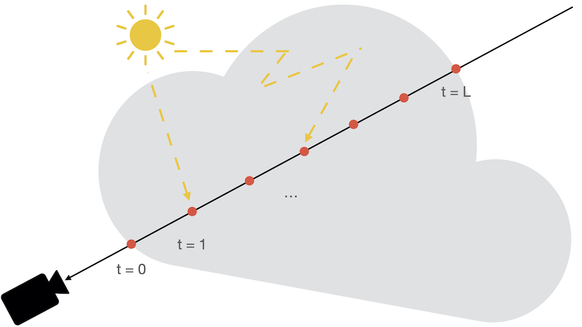
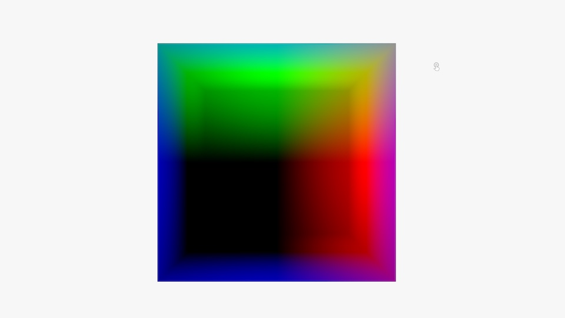
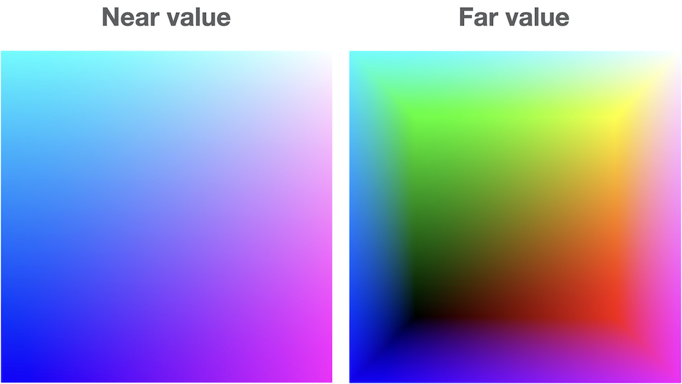
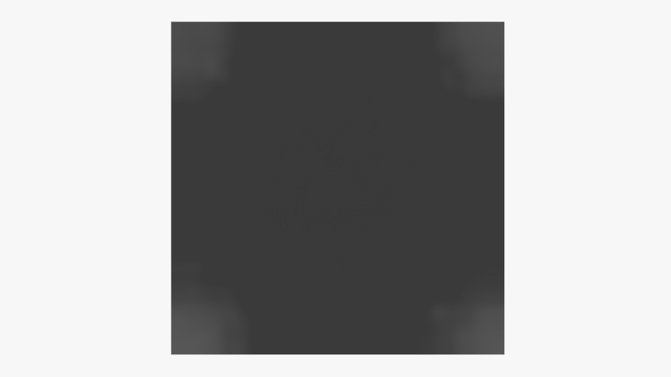
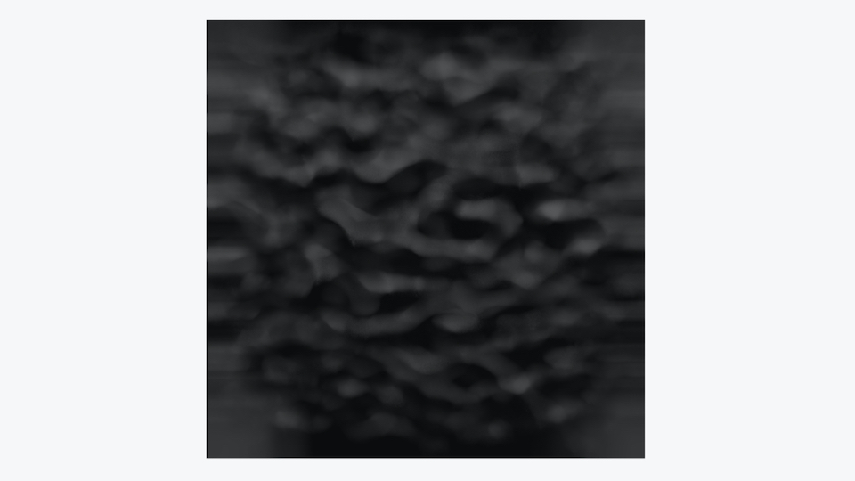
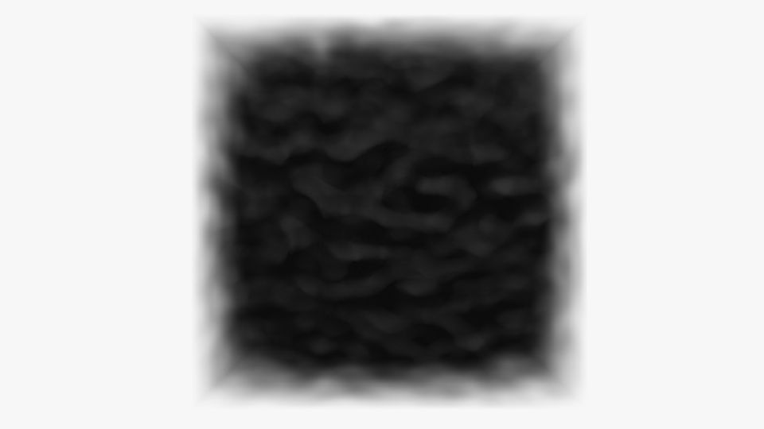
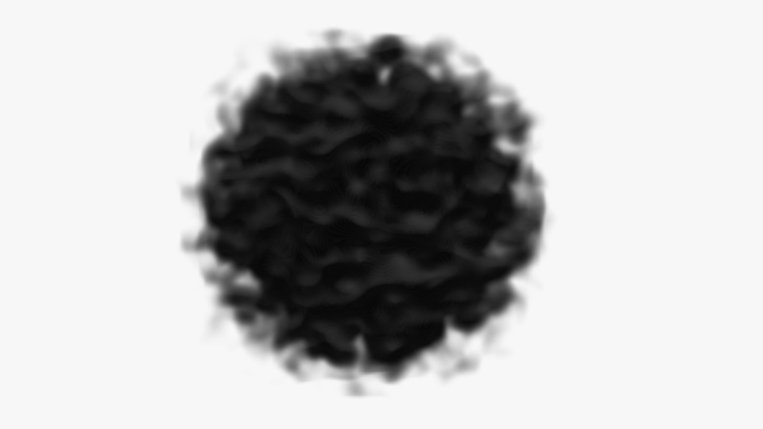
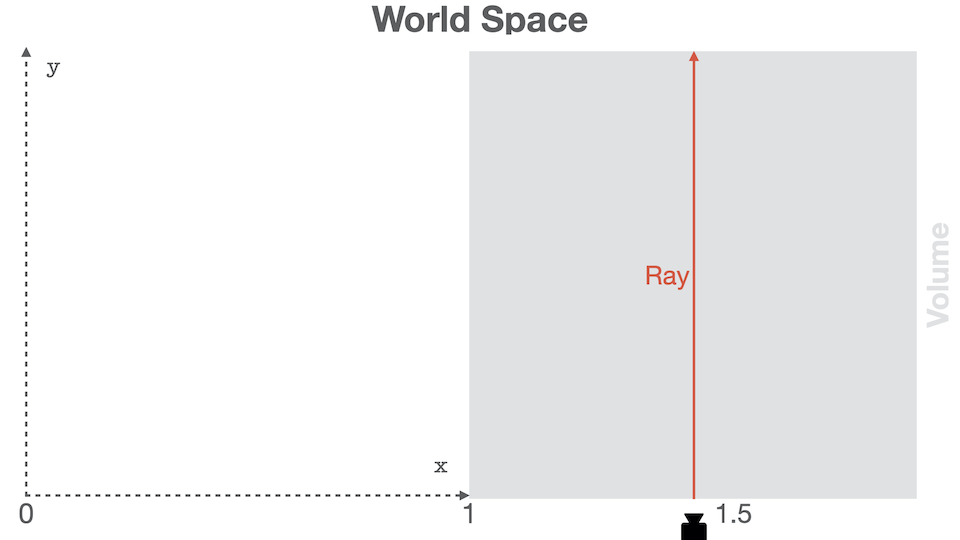
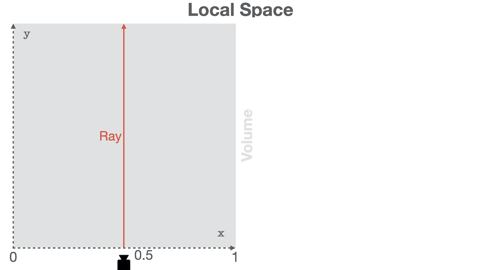
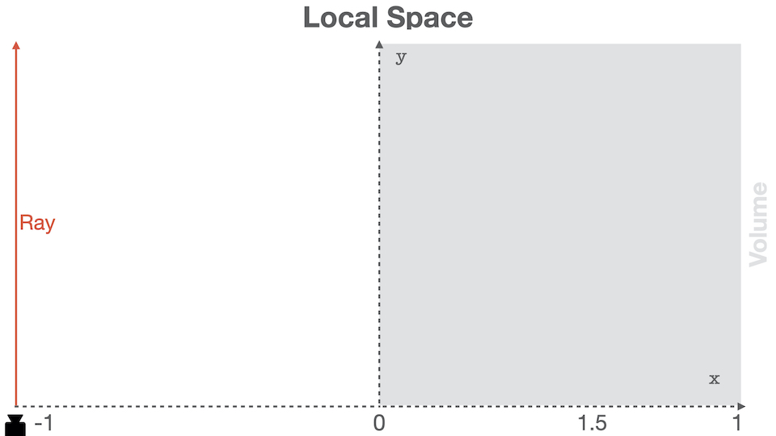

This blog post will walk you through how I created the volume rendering visualization
available on the [Home page](/).

<!--more-->


## Intro

This tutorial is made for beginners and I will try to be as descriptive as possible.
Results will be validated at each step to ensure you get the expected results.

Readers will need to be familiar with:
* [Three.js](https://threejs.org/)
* Shaders in general. Don't be afraid, you won't need to be a shader Guru
* Matrix transformations

Three.js has a nice [cloud example](https://threejs.org/examples/?q=cloud#webgl2_volume_cloud)
from which this demo is inspired. If you want to quickly integrate something I
recommend you to have a look at it.

This tutorial will be splitted into two blog posts:
* Part 1: theory, basic setup, ray generation, and first results!
* Part 2: improvements, and burning effect. This part isn't published yet.

If you are comfortable with graphics, it may be faster and more interesting
for you to dive [in the code](https://github.com/DavidPeicho/davidpeicho.github.io/tree/master/src) and simply cherry pick what you need.


This tutorial will use WebGL 3D textures. Unfortunately, it will only work
in **WebGL2**-compatible browsers.

As of October 2020, WebGL2 is landing in Safari and is available behind
an experimental flag. You can enable it in
`Develop → Experimental features → WebGL 2.0`


## Volume Rendering Overview

Volume Rendering is a vast world. There are many algorithm / techniques to
render data called _"volumes"_.

A _"volume"_ is a data set spanning **3** dimensions. In a lot of fields
(entertainement industry, medical imaging), a volume is represented by
3D grid containing data samples. 3D volumes are represented as 3D textures
where each voxel contains a given quantity, often a scalar.

At the opposite of meshes, volumes aren't defined only by a surface. Good examples
of data represented as volume may be smoke, clouds, medical scan data, etc...
Volumes are often used to represent semi-transparent medium.

Rendering a volume consists, just like for a mesh, into computing the [radiance](https://en.wikipedia.org/wiki/Radiance) reaching the camera. In simple terms, the radiance
represents the energy (the number of photons) going in a particular direction
per unit of time.

Volumes being dense (at the opposite of meshes being represented
only by a surface), there exists other mathematical models to describe interactions
between light and volumes. In general, those models assume that light can be:
* **Emitted**: corresponds to a transfer of energy, from heat to radiative for instance
* **Absorbed**: corresponds to a transfer of energy, from radiative to heat for instance
* **Scattered**: corresponds to a collision modifying the light beam trajectory

All those interactions are modeled by the Volume Rendering Equation. If you
want to go further into the theory, I highly recommend you to have a look at the
[References section](#references). The section contains a list of courses, books,
or papers that will go further into the theory.

For beginners, those links may seem advanced. You shouldn't worry If you feel like
it's too much, because we are going to apply a simplified version
of the rendering equation in this tutorial.

## Algorithm Overview

We saw in the previous section that a volume isn't defined by a set of triangles.
Thus, we can't use our classic rasterization pipeline to render them. One of the
possible way to visualize a volume is to use **Ray Marching**.
You may be familiar with [Ray Casting](https://en.wikipedia.org/wiki/Ray_casting),
where rays are shot through every pixels of the screen, and checked for intersection
with world objects. Ray Marching is similar in essence, but different during the sampling step.
When a ray intersects a volume, it is sampled at some given interval until it goes
out of the volume.



For our use case, simulating **scattering** isn't needed. Scattering turns the
rendering equation into a recursion. To compute the radiance from a given direction at a given point,
the equation needs to evaluate the radiance coming from all over.

In this tutorial, we will perform rough estimate and solve an equation that
will not be physically correct. Images we see in the world are the results
of complex phenomenons due to scattering.

It can be shown [[Engel et al, 06](https://doc.lagout.org/science/0_Computer%20Science/Real-Time%20Volume%20Graphics.pdf)] that by **neglecting** scattering effect
from the rendering equation, the radiant energy (i.e: the pixel color here) can be defined
as:

$$ R = \int_0^{L}{c(t)\exp^{-\tau(0, t)}}dt $$

With:
* $ L $ the total distance traveled in the volume
* $ t $ the distance at which light is emitted
* $ c(t) $ the radiant energy emitted at $ t $, i.e: the color at distance $ t $
* $ k(t) $ the absorption, i.e: the absorption coefficient between the eye
and the distance $ t $
* $ \tau(0, t) = \int_0^{t}{k(t)dt} $, the [Optical Depth](https://en.wikipedia.org/wiki/Optical_depth),
which is more or less the energy absorption over a given distance

We assume that the ray is sampled over a length $ L $. Let's discretize this
equation into $ N $ steps, with a delta between two steps defined as
$ \Delta_{N} = \frac{L}{N} $

the Optical Depth from the eye to the distance $ L $ can be discretized using
[Riemann sum](https://en.wikipedia.org/wiki/Riemann_sum) as

$$ \tau(0, L) \approx \sum_{i = 0}^{N}{k(i\Delta_{N})}\Delta_{N} $$

We can denote $ a_i $, the absorbance (or opacity) at the **i-th** step, as

$$ a_i = \exp^{- k(i \Delta_{N})\Delta_{N}} $$

We can then further discretize the exponential part, and directly simplify
the exponential of the sum into a product of exponential

$$ \exp^{-\tau(0, L)} \approx \prod_{i = 0}^{N}{a_i} $$

Using the same technique, we can also discretize the color part of the equation:

$$ c_i = c(i * \Delta_N)\Delta_N $$

The final equation is obtained similarly [[Engel et al, 06](https://doc.lagout.org/science/0_Computer%20Science/Real-Time%20Volume%20Graphics.pdf)]:

$$ R_{discrete} = \sum_{i=0}^N{c_i}\prod_{j=0}^{i-1}{a_j} $$

Computing the color at step **i** is equivalent to applying alpha blending to
the **i-th** sample color:

$$ R_i = R_{i-1} + a_{i-1}c_i $$

We can get an intuitive idea about what's happening. The final color of the pixel
will basically be the composition of all colors, weighted by the transmission factor.
That is to say, the more opaque the accumulated color is, the less a sample
will contribute to the final result.

At the beginning of the section, I said:

> _we can't use our classic rasterization pipeline to render them_

This was a bit of a lie my friends. To generate the rays, we are going to take
advantage of the rasterization. We are basically going to render a cube to
represent the shape of the volume, and we will use the fragment shader to perform the
ray marching inside the 3D texture.

If we sum up, the algorithm will basically be decomposed into:
1. Render cube
2. Ray generation in vertex shader
3. Ray sampling and shading
4. Blending with previous color and alpha accumulation
5. Repeat from **3** until ray exits the volume

If you feel like you want to go deeper in the math and the theory, please
have a look at the [References section](#references).

## Creating a Material

Let's start by creating a material that will reference our shaders. We will
make dummy shaders for now to ensure we did everything correctly.

_cloud.vert.glsl_

```glsl
void
main()
{
  gl_Position =
    projectionMatrix * modelViewMatrix * vec4(position, 1.0);
}
```

`projectionMatrix`, and `modelViewMatrix` are two uniforms automatically
forwarded by Three.js. `position` is the vertex attribute. You do not need
to add those because the shader is formatted with them by the renderer.

_cloud.frag.glsl_
```glsl
precision highp float;

void
main()
{
  pc_fragColor.rgba = vec4(1.0, 0.0, 0.0, 1.0);
}
```

We can now reference those shaders in a material. In order to expose a friendly
API to users, we will create our own material class that will deal with uniforms
and shader-related code.

```js
import {
  BackSide,
  ShaderMaterial,
  UniformsLib,
  UniformsUtils,
} from 'three';

import cloudVertexShader from './cloud.vert.glsl';
import cloudFragmentShader from './cloud.frag.glsl';

export class CloudMaterial extends ShaderMaterial {

  constructor() {
    super({
      vertexShader: cloudVertexShader,
      fragmentShader: cloudFragmentShader
    });

    // NOTE: This is super important. We want to only render
    // the back faces so we can generate a proper ray direction.
    this.side = BackSide;
    // Needs to be `true` so that Three.js renders our cloud
    // in an extra step, after all opaque meshes are rendered.
    this.transparent = true;
  }

}
```


Don't forget to add the line `this.side = BackSide;` because the ray generation
process relies on that. This line will make our cube only render back facing triangles.
We are going to render the cloud using a perspective camera, it's thus impossible
to generate the rays using the front faces of the cube.


## Creating a Mesh

Our volume will be first rendered as a cube, and the ray marching will happen
in the fragment shader. So let's create a simple cube:

```js
import {
  BoxBufferGeometry,
  Mesh,
} from 'three';

export class Cloud extends Mesh {

  constructor() {
    super(Cloud.DEFAULT_GEOMETRY, new CloudMaterial());
  }

}
/**
 * Unit-box geometry. This is made static for performance purpose. You will
 * not need to change the geometry of the volume.
 */
Cloud.DEFAULT_GEOMETRY = new BoxBufferGeometry(1, 1, 1);
```

There is no need for a user to mess up with the internal geometry. Thus, it's
better to create a static one instead of uploading one each time a cloud is
instanciated. The geometry s basically the position attribute and can be shared
by every cloud.

We could have simply assigned a `BoxBufferGeometry` to a `Mesh`, but it means
the user needs to know about implement details.

## Creating a Scene

We now have everything to start rendering the cube. Let's setup a basic Three.js
scene with a cloud and a camera.

```js
const renderer = new WebGLRenderer();
const camera = new PerspectiveCamera();
camera.position.z = 2.0;
camera.updateMatrix();
camera.updateMatrixWorld();

const cloud = new Cloud();

const scene = new Scene();
scene.background = new Color(0xf7f7f7);
scene.add(cloud);

// The observer triggers an event when the canvas is resized.
// On resize, we can update the camera aspect ratio,
// and update the framebuffer size using `renderer.setSize()`.
const onResize = new ResizeObserver(entries => {
  if (entries.length > 0) {
    const { width, height } = entries[0].contentRect;
    camera.aspect = width / height;
    camera.updateProjectionMatrix();
    renderer.setSize(width, height);
  }
});
onResize.observe(renderer.domElement);

function render() {
  renderer.render(scene, camera);
  window.requestAnimationFrame(render);
}
render();
```


Dont forget to add the canvas to the dom or use your own canvas in the renderer.


Nothing fancy yet, but our debbuging setup should be working:


## Generating a Volume

Our setup is ready, we now need a volume texture to sample. As stated,
a volume is simply a collection of scalars (most of the time at least :)).

WebGL 2 has support for [3D Textures](). We will thus store our volume in a
3D Texture, and sample this texture in the shader.

To generate something cloudy, we can use a [Perlin Noise](https://en.wikipedia.org/wiki/Perlin_nois) generator.
I am not going to go through how Perlin Noise works here, but if you are curious,
you can have a look at [Scratchapixel](https://www.scratchapixel.com/lessons/procedural-generation-virtual-worlds/perlin-noise-part-2) that has a detail course on it. Even better, you can also
directly have a look at [this website](https://mrl.nyu.edu/~perlin/doc/oscar.html) linking
to the original paper by Ken Perlin.

Turns out that Three.js has the implemntation of the improved Perlin noise:

_cloud.js_

```js
export function createPerlinTexture(options = {}) {

  const {
    width = 128,
    height = 128,
    depth = 128,
    scale = 0.1
  } = options;

  const voxelPerSlice = width * height;
  const voxelCount = voxelPerSlice * depth;

  // ArrayBuffer containing the volume data. This buffer is of size
  // `width` * `height` * `depth` to contain all the 3D data.
  const buffer = new Uint8Array(voxelCount);

  // Three.js implementation of the Improved Perlin Noise algorithm.
  const perlin = new ImprovedNoise();

  // Temporary vector used for in-place computation.
  const point = new Vector3();

  for (let i = 0; i < voxelCount; ++i) {
    const x = i % width;
    const y = Math.floor((i % voxelPerSlice) / width);
    const z = Math.floor(i / voxelPerSlice);
    const p = perlin.noise(x * scale, y * scale, z * scale);
    const rand = (p + 1.0) * 0.5;
    buffer[i] = Math.round(rand * 255);
  }

  const texture = new DataTexture3D(
    buffer,
    width,
    height,
    depth
  );
  texture.format = RedFormat;
  texture.minFilter = LinearFilter;
  texture.magFilter = LinearFilter;
  texture.unpackAlignment = 1;

  return texture;
}
```

This function generates a buffer with random values. This buffer is used to
create a `DataTexture3D`, which is a Three.js class representing a WebGL
texture 3D.

The texture is uploaded as `Uint8`, thus the perlin noise is mapped to the
interval `[0...255]`.

In order to improve the shape of the noise and make it look more spherical,
let's modify the function slightly to fade away the cloud from its center.

_cloud.js_

```js
export function createPerlinTexture(options = {}) {
  ...

  const halfWidth = width * 0.5;
  const halfHeight = height * 0.5;
  const halfDepth = depth * 0.5;
  // Temporary vector used for in-place computation.
  // This is used to improve performance and reduce GC.
  const point = new Vector3();
  for (let i = 0; i < voxelCount; ++i) {
    ...

    const v = point.set(
      (x - halfWidth) / width,
      (y - halfHeight) / height,
      (z - halfDepth) / depth
    );
    // `d` goes to zero when the current sample is far from
    // the volume center.
    // At the opposite, `d` goes to one when the sample is close
    // to the volume center.
    const d = clamp(1.0 - v.length(), 0, 1);

    const p = perlin.noise(x * scale, y * scale, z * scale);
    const rand = (p + 1.0) * 0.5;

    // The noise is scaled by how far it is from the center.
    // This is used to improve the shape of the cloud and
    // make it appear more spherical.
    buffer[i] = Math.round(rand * d * d * 255);
  }
  ...
}
```

Finally, we modify our `CloudMaterial` class to send the texture to the shader
as a uniform:

_material.js_

```js
export class CloudMaterial extends ShaderMaterial {

  constructor() {
    super({
      vertexShader: cloudVertexShader,
      fragmentShader: cloudFragmentShader,
      uniforms: {
        uVolume: { value: null }
      }
    });
  }

  set volume(texture) {
    this.uniforms.uVolume.value = texture;
  }

  get volume() {
    return this.uniforms.uVolume.value;
  }

}
```

We can now create the texture, and assign it to the shader:

```js
window.onload = function () {
  ...

  const cloud = new Cloud();
  cloud.material.volume = createPerlinTexture({ scale: 0.09 });

  ...
};
```

## Ray Generation

We need to generate, for every fragment, a ray that will step through the volume.
In the vertex shader, we have access to vertices position as well as the camera
information. It's possible to generate a ray that will start at the camera origin,
and go through the vertex position.

For now, we will assume the cloud and the ray origin (i.e., the camera) are static.
Let's see how the code looks:

_cloud.vert.glsl_

```glsl
// We need to send the origin of the ray, as well
// as the direction.
struct Ray {
  vec3 origin;
  vec3 dir;
};

out Ray vRay;

void
main()
{
  // Hardcoded for now. This should the camera position.
  vec3 cameraPosition = vec3(0.0, 0.0, 2.0);

  vRay.dir = position - cameraPosition;
  vRay.origin = cameraPosition + vec3(0.5);
  gl_Position = projectionMatrix * modelViewMatrix * vec4(position, 1.0);
}
```

As you can see, the ray **isn't** specified in World Space, but rather in
**Model Space**. Let's continue a bit, and this will be explained later in the
[Improving Ray Generation](#improving-ray-generation) section.

You may be wondering why the origin has an offset of `vec3(0.5)`. The `BoxBufferGeometry`
we created is centered around `(0, 0, 0)`, but the volume texture needs to be
sampled using normalized coordinates in the range `[0...1].`


**Do not** move the camera from the position `(0, 0, 2)` yet, and **do not**
move the cloud. Otherwise, the sampling will be wrong with the current code.
In the section [Improving Ray Generation](#improving-ray-generation), we will
see how to modify the shader to generate a proper ray.


To validate our ray origin and direction, let's first display the ray direction
in the fragment shader:

_cloud.frag.glsl_

```glsl
precision highp float;

struct Ray {
  vec3 origin;
  vec3 dir;
};

in Ray vRay;

void
main()
{
  Ray ray;
  ray.origin = vRay.origin;
  ray.dir = normalize(vRay.dir);
  pc_fragColor.rgba = vec4(ray.dir, 1.0);
}
```

If we did everything good, we should something like that:



The result looks correct, we can start marching the volume. But before, we need
to:

1. Move the ray origin to the closest volume bound. We could step directly from
the camera origin, but why would we do that? There is nothing to sample there.
It's faster to first move the ray origin to the closest volume intersecton.
2. Scale the ray direction by the step size we want to perform. A too small
step size will make the ray sample several times the same voxel. At the opposite,
a too big step size and the ray may "miss" important information.

In order to find the nearest and farthest ray - volume intersection,
we can solve a Ray-Box intersection. We know that our box will always be defined
by `min = vec3(0, 0, 0)` and `max = vec3(1, 1, 1)`, that will simplify our
function:

_cloud.frag.glsl_

```glsl
/**
 * Computes the intersection between a ray and the unit box
 * centered on (0, 0, 0).
 *
 * Closest intersecton distance is return in `near`, and
 * furthest intersection is returned in `far`.
 */
void
computeNearFar(Ray ray, inout float near, inout float far)
{
  // Ray is assumed to be in local coordinates, ie:
  // ray = inverse(objectMatrix * invCameraMatrix) * ray
  // Equation of ray: O + D * t

  vec3 invRay = 1.0 / ray.dir;

  // Shortcut here, it should be: `aabbMin - ray.origin`.
  // As we are always using normalized AABB, we can skip the line
  // `(0, 0, 0) - ray.origin`.
  vec3 tbottom = - invRay * ray.origin;
  vec3 ttop = invRay * (vec3(1.0) - ray.origin);

  vec3 tmin = min(ttop, tbottom);
  vec3 tmax = max(ttop, tbottom);

  float largestMin = max(max(tmin.x, tmin.y), max(tmin.x, tmin.z));
  float smallestMax = min(min(tmax.x, tmax.y), min(tmax.x, tmax.z));

  near = largestMin;
  far = smallestMax;

  return smallestMax > largestMin;
}
```

As usual, let's be sure that this function is doing what we want by displaying
the result. The ray position is supposed to be located in the unit box spanning
`[0...1]`.

_cloud.frag.glsl_

```glsl
void
main()
{
  Ray ray;
  ray.origin = vRay.origin;
  ray.dir = normalize(vRay.dir);

  // Solves a ray - Unit Box equation to determine the value of the closest and
  // furthest intersections.
  float near = 0.0;
  float far = 0.0;
  computeNearFar(ray, near, far);

  // Moves the ray origin to the closest intersection.
  // We don't want to spend time sampling nothing out of the volume!
  ray.origin = ray.origin + near * ray.dir;

  pc_fragColor.rgba = vec4(ray.origin, 1.0);
}
```

If the function is correct, we should see all colors nicely interpolated:



Last step missing: scaling the ray direction!

You could either ask the user to choose for a **sampling ratio**, or simply
compute a minimal one, by using the smallest component in the ray direction.

You could als sample the volume from `near` to `far`, using a step
size of `(far - near) / NB_STEPS`. However, I don't want the step size to be
different for each ray, so I decided to go for the classic:

```glsl
vec3 inc = 1.0 / abs( ray.dir );
// Step size between two samples
float delta = min(inc.x, min(inc.y, inc.z)) / float(NB_STEPS);
// The ray direction is now scaled by the step size.
ray.dir = ray.dir * delta;
```

Putting it all together, you get:

_cloud.frag.glsl_

```glsl
void
main()
{
  Ray ray;
  ray.origin = vRay.origin;
  ray.dir = normalize(vRay.dir);

  // Solves a ray - Unit Box equation to determine the value of the closest and
  // furthest intersections.
  float near = 0.0;
  float far = 0.0;
  computeNearFar(ray, near, far);

  // Moves the ray origin to the closest intersection.
  // We don't want to spend time sampling nothing out of the volume!
  ray.origin = ray.origin + near * ray.dir;

  vec3 inc = 1.0 / abs( ray.dir );
  // Step size between two samples
  float delta = min(inc.x, min(inc.y, inc.z)) / float(NB_STEPS);
  // The ray direction is now scaled by the step size.
  ray.dir = ray.dir * delta;

  pc_fragColor.rgba = vec4(ray.origin, 1.0);
}
```

## Sampling

Phew! So much things to do and we haven't yet sampled the volume! Don't give up
now, we are almost at it!

Don't forget to add the uniform in the fragment shader, as well as the `precision`:

_cloud.frag.glsl_
```glsl
...

precision highp sampler3D;
uniform sampler3D uVolume;

...
```

We now need to march the volume and weight samples according to how much
accumulation already happened.

_cloud.frag.glsl_
```glsl
// ...

vec3 inc = 1.0 / abs( ray.dir );
float delta = min(inc.x, min(inc.y, inc.z)) / float(NB_STEPS);
ray.dir = ray.dir * delta;

// Hardcoded for now: diffuse color of our cloud.
vec3 baseColor = vec3(0.1);

// Accumulation through the volume is stored in this variable.
vec4 acc = vec4(0.0);

for (int i = 0; i < NB_STEPS; ++i)
{
  // Get the voxel at the current ray position.
  float s = texture(uVolume, ray.origin).r;

  // The more we already accumulated, the less color we apply.
  acc.rgb += (1.0 - acc.a) * s * baseColor;
  // The more we already accumulated, the less opacity we apply.
  acc.a += (1.0 - acc.a) * s;

  // Early termination: after this threshold, accumulating becomes insignificant.
  if (acc.a > 0.95) { break; }

  ray.origin += ray.dir;
}
```

This code should give you something like:



Not exactly what we expected.

Right now, we are simply accumulating the color and the transparency. However,
almost all rays will end up with the same color because the shading is the same
for every directions.

Let's modulate the color slightly by using the gradient. To compute the gradient,
we will use th method of th [Finite Differences]():

```glsl
/*
 * Computes the gradient at the given position.
 *
 * **NOTE**: The position must be given in Model Space.
 */
vec3
computeGradient(vec3 position, float step)
{
  return normalize(vec3(
    getSample(position.x + step, position.y, position.z)
    - getSample(position.x - step, position.y, position.z),
    getSample(position.x, position.y + step, position.z)
    - getSample(position.x, position.y - step, position.z),
    getSample(position.x, position.y, position.z + step)
    - getSample(position.x, position.y, position.z - step)
  ));
}
```

Let's modulate the color of the sample by using a directional light
with direction `(0, -1, 0)`. The light is going to be attenuated using a cosine
factor:

```glsl
// ... main()

vec3 lightDir = vec3(0., -1., 0.);

for (int i = 0; i < NB_STEPS; ++i)
{
  float s = texture(uVolume, ray.origin).r;

  // Gradient of the sample at the ray position.
  vec3 gradient = computeGradient(ray.origin, delta);
  float NdotL = max(0., dot(gradient, lightDir));

  // The more we already accumulated, the less color we apply.
  acc.rgb += (1.0 - acc.a) * s * baseColor * NdotL;
  // The more we already accumulated, the less opacity we apply.
  acc.a += (1.0 - acc.a) * s * 0.5;

  // Early termination: after this threshold,
  // accumulating becomes insignificant.
  if (acc.a > 0.95) { break; }

  ray.origin += ray.dir;
}
```

And we should now obtain:



Okay, we are starting to get convincing results here. However, we generated our
cloud to be empty around the edges of the cube. The sampling still
takes into account those values.

The issue arises because in some cases, the ray
is still getting sampled outside the volume. Technically, the ray shouldn't
be sampled anymore after leaving the volume. For that, let's check when the ray
goes beyond the `far` value:

_cloud.frag.glsl_
```glsl
// ... main()

...

float dist = near;

for (int i = 0; i < NB_STEPS; ++i)
{
  ...
  ray.origin += ray.dir;
  dist += delta;

  if (dist >= far) { break; }
}
```



You may still think that the result isn't exactly what you wanted. We can
modulate the value of the sample on the fly to change the cloud shape.
Let's start by applying some **windowing**, i.e., shift the sample values:

_cloud.frag.glsl_
```glsl
...
for (int i = 0; i < NB_STEPS; ++i)
{
  float s = texture(uVolume, ray.origin).r;
  // Clamps the sample value between `0.12` and `0.35` smoothly.
  s = smoothstep(0.12, 0.35, s);
  ...
}
```

Just changing that should change everything:




## Improving Ray Generation

Right now, the camera origin is hardcoded in the shader to `(0, 0, 2)`.

If you recall, we decided to generate a ray in **Local Space**. Thus, the ray
was generated directly by using the `position` attribute, where each
vertex coordinate was in the range `[0...1]`.

In order for the ray origin to be expressed in **Local Space** no matter where
the camera is, we can get use inverse transformation of the composition of the
model and camera matrix. Phew! That's a complicated sentence. Let's try to find
an intuitive way to visualize this. We can either express everything in **World Space**
and sample the volume accordingly, or we can apply the inverse transformations
and directly sample the volume:





Those two drawings are equivalent **regarding volume sampling**. Obviously,
if you now want to compare the ray to another object (a light for instance),
both will be in different space, which would result in wrong calculation.

By working in **Local Space**, we know that our ray is always in the `[0...1]`
range. If the ray isn't, it means that it's simply not intersecting our volume,
and then we don't need to proccess it.



In order to generate a proper ray, we thus only need to use the camera origin
in the volume local space. We can thus multiply the camera world position by
the inverse world matrix of the volume.

Let's start by sending the camera position as a uniform to the shader:

_material.js_
```js
export class CloudMaterial extends ShaderMaterial {

  constructor() {
    super({
      ...
      uniforms: {
        ...
        uLocalSpaceCameraOrigin: { value: new Vector3() },
        ...
      }
    });
  }

  update(object3d, camera) {
    const localOriginUniform =
      this.uniforms.uLocalSpaceCameraOrigin.value;

    // Use a global variable to perform in-place inverse.
    // This is faster that allocating a matrix.
    gMatrix4.getInverse(object3d.matrixWorld);
    // Copies the camera world position into the uniform.
    // NOTE: the camera world matrix **must be** up-to-date!
    camera.getWorldPosition(localOriginUniform);
    // Transform the camera world space into the volume
    // local space using the above inverse transform.
    localOriginUniform.applyMatrix4(gMatrix4);
  }
```

We can use this position directly into the vertex shader:

_cloud.vert.glsl_
```glsl
struct Ray {
  vec3 origin;
  vec3 dir;
};

out Ray vRay;

uniform vec3 uLocalSpaceCameraOrigin;

void
main()
{
  vRay.dir = position - uLocalSpaceCameraOrigin;
  vRay.origin = uLocalSpaceCameraOrigin + vec3(0.5);
  gl_Position = projectionMatrix * modelViewMatrix * vec4(position, 1.0);
}
```

The camera is no longer hardcoded, you can move around the volume. A nice feature
to add would be to code camera controls, or use one of the ones
[provided by Three.js](https://threejs.org/docs/#examples/en/controls/OrbitControls).

## Going Further

You did it!

If you took a look at the [code](https://github.com/DavidPeicho/davidpeicho.github.io/blob/master/src/shaders/cloud.frag.glsl), you will see a bit more stuff. The shader is customizable using uniforms
and preprocessor directives.

You can customize this tutorial in a lot of way:

* Add the base color as uniform;
* Send the light as a uniform and modify its properties through time;
* Improve the lighting, with some crazy alien stuff for instance!
* Basically everything you could think of :)

In the next blog post, we will improve the rendering, and I will show you
how I created the _"fire"-like_ effect.

# References

1. [Fong J., Wrenninge M., Kulla C., & Habel R., SIGGRAPH 2017, Production Volume Rendering](https://graphics.pixar.com/library/ProductionVolumeRendering/paper.pdf)
2. [Engel K., Hadwiger M.,  M. Kniss J.,  Rezk-Salama, C., 2006, Real-Time Volume Graphics](https://doc.lagout.org/science/0_Computer%20Science/Real-Time%20Volume%20Graphics.pdf)
3. [Pharr M., Jakob .W, & Humphreys .G, Physically Based Rendering: From Theory To Implementation](http://www.pbr-book.org/3ed-2018/Volume_Scattering.html)
4. [Perlin K., 97, Improving Noise](https://mrl.nyu.edu/~perlin/paper445.pdf)
